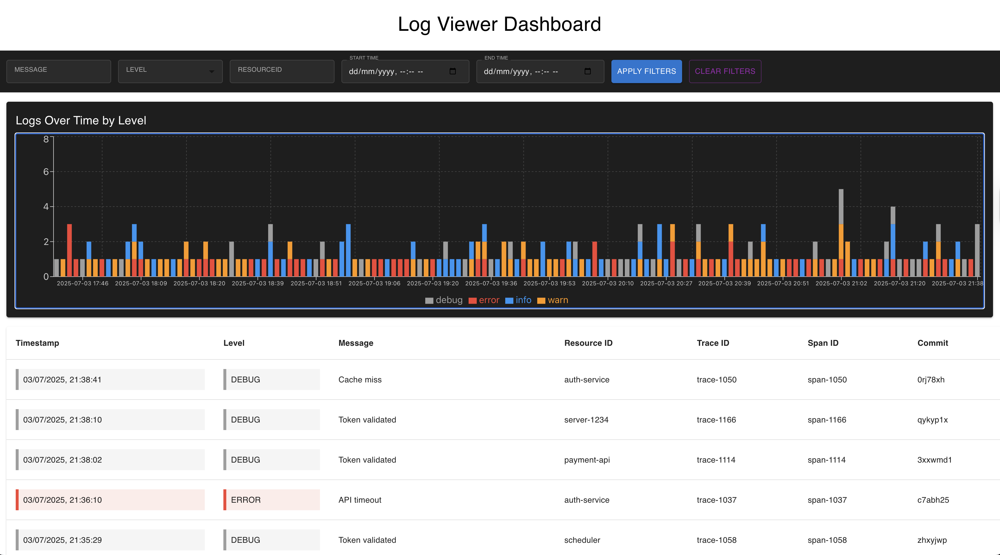

# 📘 Log Ingestion and Querying System

This project is a full-stack developer take-home assignment that simulates a real-world developer tool used for monitoring and debugging applications. It includes:

- ✅ A **Node.js + Express** backend with JSON file persistence
- ✅ A **React.js frontend** for filtering and visualizing logs
- ✅ A clean, responsive UI inspired by tools like **Grafana Loki**

---

## 🚀 Table of Contents

- [Overview](#overview)
- [Features](#features)
- [Architecture](#architecture)
- [Tech Stack](#tech-stack)
- [Setup Instructions](#setup-instructions)
- [API Documentation](#api-documentation)
- [Design Decisions](#design-decisions)
- [Screenshots](#screenshots)


---

## 📌 Overview

The core objective is to build a self-contained **Log Ingestion and Querying System** that:

- Accepts log data via a `POST /logs` API
- Stores logs in a local JSON file
- Allows developers to search, filter, and view logs in a modern UI
- Provides basic analytics via a time-series chart


---

## ✅ Features

### 🔁 Log Ingestion

- Accepts logs via `POST /logs`
- Validates log structure and types
- Stores logs in a local JSON file using `node-json-db`

### 🔍 Log Viewing & Filtering

- View logs in reverse-chronological order
- Full-text search on `message` field (**debounced**)
- Filter by:
  - `level` (multi-select)
  - `resourceId` (**debounced**)
  - `timestamp` range (start and end)
- Combine filters using **AND** logic
- Clear filters with a single click

### 📊 Analytics Dashboard

- Stacked bar chart showing **log count by level over time**
- Time on X-axis, count on Y-axis
- Colors match severity level (e.g., red for error, yellow for warn)

### 🎨 UI/UX

- Dark theme inspired by Grafana Loki
- Filter bar with consistent alignment and chip-based multi-selects
- Clean table layout with visual cues for log severity
- Responsive layout for desktop screens

---

## 🏗️ Architecture
frontend/
├── components/
│ ├── FilterBar.js
│ ├── LogTable.js
│ ├── AnalyticsDashboard.js
├── services
│ ├── logServices.js
├── App.js
└── index.js

backend/
├── app.js
├── db.js
├── logs.json
├── common/
│ ├── constants.js
│ ├── utils.js
├── controllers/
│ ├── logContoller.js
├── routes/
│ ├── logRoute.js


---

## 🛠️ Tech Stack

| Layer     | Technology               |
|-----------|---------------------------|
| Backend   | Node.js, Express, node-json-db |
| Frontend  | React, Material UI (MUI), Recharts |
| Charting  | Recharts (stacked bar chart) |
| Debounce  | Lodash.debounce |
| Storage   | Local JSON file (`logs.json`) |

---

## ⚙️ Setup Instructions

### 🔧 Backend

```bash
cd backend
npm install
node app.js

Runs on http://localhost:4000
Logs stored in logs.json

💻 Frontend

cd frontend
npm install
npm start
Runs on http://localhost:3000


🧠 Design Decisions
✅ Chosen Libraries
node-json-db: Simplifies JSON file persistence and avoids manual fs logic
lodash.debounce: Clean, reliable debounce for message and resourceId
Material UI: Rapidly build a clean, professional UI
Recharts: Lightweight, responsive charting library
✅ Why No Redux?
The app’s state was manageable with useState and useEffect
Adding Redux would add unnecessary complexity
✅ Folder Structure
Clear separation of UI components, hooks, services, and utilities
Designed for scalability and maintainability


🖼️ Screenshots

